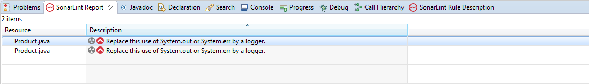
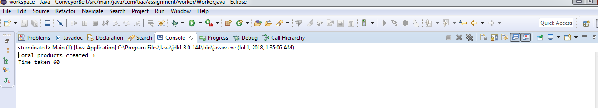
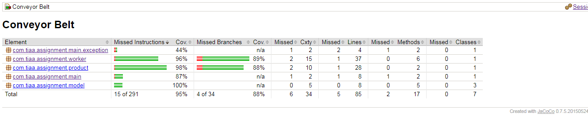

Section 1
	Name: Ankit Agarwal
	Years of Experience: 8 years 1 month

Section 2: 
	Build IDE: Eclipse Java EE IDE (Version: Neon.3 Release (4.6.3))
	JDK Version: java version "1.8.0_144"

Section 3 

a)	Sonar lint / EclEmma scan Snapshot:
        
b)	Final Output Snapshot :
        
c)	Junit Coverage Snapshot : 
        

Section 4 
Licensing 
A)	THE CODE DOES NOT HAVE ANY COPYRIGHT WHATSOEVER. 
b)	THE CODE IS NOT GOVERNED BY ANY LICENSES WHATSOEVER. 
c)	THE SOFTWARE IS PROVIDED "AS IS", WITHOUT WARRANTY OF ANY KIND, EXPRESS OR IMPLIED, INCLUDING BUT NOT LIMITED TO THE WARRANTIES OF MERCHANTABILITY, FITNESS FOR A PARTICULAR PURPOSE AND NONINFRINGEMENT. IN NO EVENT SHALL THE AUTHORS OR USERS OF THE CODE WOULD BE LIABLE FOR ANY CLAIM, DAMAGES OR OTHER LIABILITY, WHETHER IN AN ACTION OF CONTRACT, TORT OR OTHERWISE, ARISING FROM, OUT OF OR IN CONNECTION WITH THE SOFTWARE OR THE USE OR OTHER DEALINGS IN THE SOFTWARE.
